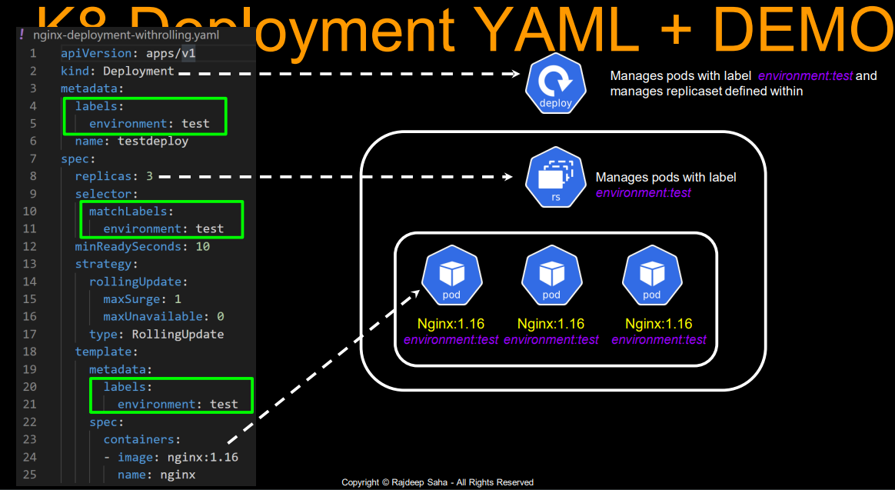
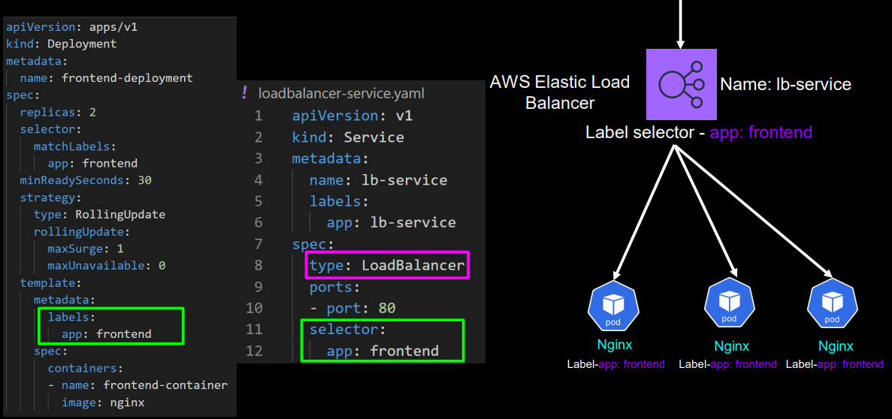

### Java App Deployment with Yml
http://localhost:8111/devops/blue/swagger-ui/index.html#/

### Example's


### devops-blue-deployment.yml
```
apiVersion: apps/v1
kind: Deployment
metadata:
  name: devops-blue-deployment
  labels:
    app.kubernetes.io/name: devops-blue
spec:
  selector:
    matchLabels:
      app.kubernetes.io/name: devops-blue
  template:
    metadata:
      labels:
        app.kubernetes.io/name: devops-blue
        app.kubernetes.io/version: 1.0.0
    spec:
      containers:
      - name: devops-blue
        image: naveen2809/devops-blue:1.0.0
        resources:
          limits:
            cpu: "0.5"
            memory: 500M
        ports:
        - name:  http
          containerPort: 8111
          protocol: TCP
  replicas: 2

```
### devops-blue-service.yml  
```
apiVersion: v1
kind: Service
metadata:
  name: devops-blue-service
  labels:
    app.kubernetes.io/name: devops-blue
spec:
  selector:
    app.kubernetes.io/name: devops-blue
  type:  LoadBalancer
  ports:
  - name: devops-blue-port
    port: 8111         # port number to be available at host
    targetPort: 8111   # port on pod
```
### Create Resource's
```
kubectl apply -f devops-blue-deployment.yml
kubectl apply -f devops-blue-service.yml   
```
```
minikube tunnel
```
### Access Application
http://localhost:8111/devops/blue/swagger-ui/index.html#/
```
kubectl get all
NAME                                         READY   STATUS    RESTARTS   AGE
pod/devops-blue-deployment-9977c9d76-hsxwl   1/1     Running   0          37s
pod/devops-blue-deployment-9977c9d76-wdgqd   1/1     Running   0          37s

NAME                          TYPE           CLUSTER-IP      EXTERNAL-IP   PORT(S)          AGE
service/devops-blue-service   LoadBalancer   10.100.101.37   <pending>     8111:32508/TCP   29s
service/kubernetes            ClusterIP      10.96.0.1       <none>        443/TCP          137m

NAME                                     READY   UP-TO-DATE   AVAILABLE   AGE
deployment.apps/devops-blue-deployment   2/2     2            2           37s

NAME                                               DESIRED   CURRENT   READY   AGE
replicaset.apps/devops-blue-deployment-9977c9d76   2         2         2       37s


kubectl get svc --show-labels
NAME                  TYPE           CLUSTER-IP      EXTERNAL-IP   PORT(S)          AGE    LABELS
devops-blue-service   LoadBalancer   10.100.101.37   127.0.0.1     8111:32508/TCP   2m5s   app.kubernetes.io/name=devops-blue
kubernetes            ClusterIP      10.96.0.1       <none>        443/TCP          139m   component=apiserver,provider=kubernetes
```
### Modify Configuration
```
Again kubectl apply -f file-name.yml 
- Delete Existing pod's create new pod's
```
### Delete Resource's
```
kubectl delete -f devops-blue-deployment.yml
kubectl delete -f devops-blue-service.yml   
```

## Everything in Single File
### devops-blue.yml
```
apiVersion: v1
kind: Namespace
metadata:
  name:  devops
---
apiVersion: apps/v1
kind: Deployment
metadata:
  namespace: devops
  name: devops-blue-deployment
  labels:
    app.kubernetes.io/name: devops-blue
spec:
  selector:
    matchLabels:
      app.kubernetes.io/name: devops-blue
  template:
    metadata:
      labels:
        app.kubernetes.io/name: devops-blue
        app.kubernetes.io/version: 1.0.0
    spec:
      containers:
      - name: devops-blue
        image: naveen2809/devops-blue:1.0.0
        resources:
          limits:
            cpu: "0.5"
            memory: 500M
        ports:
        - name:  http
          containerPort: 8111
          protocol: TCP
  replicas: 2
---
apiVersion: v1
kind: Service
metadata:
  namespace: devops
  name: devops-blue-service
  labels:
    app.kubernetes.io/name: devops-blue
spec:
  selector:
    app.kubernetes.io/name: devops-blue
  type:  LoadBalancer
  ports:
  - name: devops-blue-port
    port: 8112         # port number to be available at host
    targetPort: 8111   # port on pod
```
```
kubectl get pods -n devops
NAME                                     READY   STATUS    RESTARTS   AGE
devops-blue-deployment-9977c9d76-f7r7v   1/1     Running   0          20s
devops-blue-deployment-9977c9d76-l49js   1/1     Running   0          20s

kubectl get pods -n devops --show-labels
NAME                                     READY   STATUS    RESTARTS   AGE   LABELS
devops-blue-deployment-9977c9d76-f7r7v   1/1     Running   0          32s   app.kubernetes.io/name=devops-blue,app.kubernetes.io/version=1.0.0,pod-template-hash=9977c9d76
devops-blue-deployment-9977c9d76-l49js   1/1     Running   0          32s   app.kubernetes.io/name=devops-blue,app.kubernetes.io/version=1.0.0,pod-template-hash=9977c9d76

kubectl get deploy -n devops --show-labels
NAME                     READY   UP-TO-DATE   AVAILABLE   AGE   LABELS
devops-blue-deployment   2/2     2            2           89s   app.kubernetes.io/name=devops-blue

kubectl get svc -n devops --show-labels
NAME                  TYPE           CLUSTER-IP     EXTERNAL-IP   PORT(S)          AGE   LABELS
devops-blue-service   LoadBalancer   10.107.24.59   127.0.0.1     8112:32486/TCP   99s   app.kubernetes.io/name=devops-blue
```